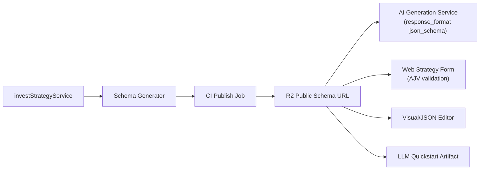

# From Rule-Based Scripts to AI-Native Engines: Why I Built a Constrained DSL

## 1. The Builder's Journey

Hi, I'm Dawei ([@madawei2699](https://github.com/madawei2699)), an independent builder who's shipped open-source tools like [myGPTReader](https://github.com/myreader-io/myGPTReader) (4.4k stars) and [invest-alchemy](https://github.com/myinvestpilot/invest-alchemy) (750+ stars).

Now, through MyInvestPilot, I'm exploring how to make LLMs truly reliable for composing complex, verifiable decision logic. Whether you're in quant trading, AI agents, or building constrained decision systems, I hope this resonates.

My journey didn't start with a desire to build a DSL. It started with **pain**.

`invest-alchemy` was my first attempt: a library for scheduled, rule-based trading tasks. It worked great for me, but when I tried to let AI (Agents) use it, it fell apart. The AI would hallucinate libraries, write infinite loops, or create strategies that looked correct but were financially dangerous (look-ahead bias).

I realized that **General-purpose code is too unconstrained for reliable AI-driven decision systems.** Code is too broad. It allows *anything* to happen.

To build a truly AI-Native system, I needed a **General Decision Engine** that separates *Intent* from *Execution*.

## 2. The Core Decision: Why Not Just Fix the Code?

I evaluated three paths to make AI reliable:

### Path A: Code Generation + Sandbox (The "Natural" Choice)
The most obvious idea: *Just let the AI write Python code and run it in a secure Sandbox.*
*   **Pros**: Infinite flexibility.
*   **Cons**: **Hallucination & Safety**. Even with a sandbox, malicious logic (like infinite resource consumption) is hard to contain. And when the AI writes a bug, the user can't fix it because they don't know Python.

### Path B: The "Super API" (REST/GraphQL)
The standard SaaS approach: *Build a massive API endpoint where users config params.*
*   **Pros**: Safe. Easy to validate.
*   **Cons**: **Parameter Explosion**. To support "RSI > 30 AND (MA50 > MA200 OR Volume > 1M)", the API parameters became a nightmare of nested objects.

### Path C: The Decision (DSL)
I realized I needed the **Safety of an API** but the **Expressiveness of Code**.
I needed a **Domain Specific Language**.

*   **Constraint**: The AI can only use valid "Primitives" (LEGO blocks). It cannot import `os` or `sys`.
*   **Expressiveness**: It can combine these blocks orthogonally (Trend + Logic + Risk).
*   **Visual**: Because it's structured data (JSON), I can build a [visual editor](https://www.myinvestpilot.com/primitives-editor) (a quick visual demo) to verify AI output instantly.

## 3. The Engineering Muscle: Schema Supply Chain

The real magic isn't just the DSL; it's how we teach the AI to use it. In MyInvestPilot, the **Schema is the Source of Truth**.

We don't manually write prompts. We have a **Schema Supply Chain**:



1.  **Auto-Generated Prompts**: The [Quickstart Guide](https://www.myinvestpilot.com/docs/primitives/_llm/llm-quickstart.txt) (publicly viewable) is generated from the schema during the build. No drift between the engine and the AI's instruction manual.
2.  **Layered Validation**:
    *   **Layer A (Front-End)**: AJV compiles the schema to catch structural errors instantly.
    *   **Layer B (Back-End)**: Service-side validators ensure strict type safety.
    *   **Layer C (Semantic)**: Custom logic checks for domain rules (e.g., "Fundamental metrics must match point-in-time constraints").

This turns the LLM from a "creative writer" into a **reliable compiler frontend**.

This pipeline turns the schema into a shared contract between humans, AI, and the execution engine.

## 4. The Solution: Orthogonal Primitives & Validation

This engine treats investment not as a script, but as a configuration of **Orthogonal Truths**.

### Case Study: Fundamental Risk Control

To validate this engine, I implemented a complex multi-factor risk model. This isn't a toy example; it demonstrates how the DSL handles technical trend following, fundamental health checks, and dynamic position sizing in a single declarative graph.

**The Logic**:
1.  **Trend Filter**: Market must be in an uptrend (EMA50 > EMA200).
2.  **Quality Gate**: Company must have ROE > 10% and Positive Cashflow.
3.  **Safety Gate**: Debt Ratio must be under 80%.
4.  **Dynamic Sizing**: If Debt is high, reduce position size (Linear Weighting).

**The AI-Generated Configuration (JSON)**:

```json
{
  "fundamental_inputs": {
    "metrics": ["roe", "pe_ttm", "revenue_yoy", "operating_cashflow", "debt_ratio"],
    "frequency": "daily",
    "point_in_time": true, 
    "max_staleness_days": 120
  },
  "trade_strategy": {
    "indicators": [
      { "id": "ema_fast", "type": "EMA", "params": { "period": 50, "column": "Close" } },
      { "id": "ema_slow", "type": "EMA", "params": { "period": 200, "column": "Close" } },
      { "id": "roe_metric", "type": "ROE" },
      { "id": "debt_metric", "type": "DebtRatio" },
      { "id": "cashflow_metric", "type": "OperatingCashflow" },
      { "id": "roe_min", "type": "Constant", "params": { "value": 10.0 } },
      { "id": "debt_max", "type": "Constant", "params": { "value": 80.0 } },
      { "id": "cashflow_min", "type": "Constant", "params": { "value": 0.0 } }
    ],
    "signals": [
      // 1. Technical Trend
      { "id": "trend_up", "type": "GreaterThan", "inputs": [{ "ref": "ema_fast" }, { "ref": "ema_slow" }] },
      // 2. Fundamental Gates
      { "id": "roe_ok", "type": "GreaterThan", "inputs": [{ "ref": "roe_metric" }, { "ref": "roe_min" }] },
      { "id": "debt_ok", "type": "LessThan", "inputs": [{ "ref": "debt_metric" }, { "ref": "debt_max" }] },
      { "id": "cashflow_ok", "type": "GreaterThan", "inputs": [{ "ref": "cashflow_metric" }, { "ref": "cashflow_min" }] },
      // 3. Combine Logic (AND)
      {
        "id": "risk_gate",
        "type": "And",
        "inputs": [ { "ref": "trend_up" }, { "ref": "roe_ok" }, { "ref": "debt_ok" }, { "ref": "cashflow_ok" } ]
      },
      // 4. Dynamic Position Sizing based on Debt
      {
        "id": "debt_scaled_weight",
        "type": "LinearScaleWeight",
        "inputs": [{ "ref": "debt_metric" }],
        "params": {
          "min_indicator": 20.0, "max_indicator": 80.0,
          "min_weight": 1.0, "max_weight": 0.45,
          "clip": true
        }
      },
      // 5. Final Execution Signal
      {
        "id": "target_weight_signal",
        "type": "Multiply",
        "inputs": [{ "ref": "debt_scaled_weight" }, { "ref": "risk_gate" }]
      }
    ],
    "outputs": {
      "buy_signal": "risk_gate",
      "target_weight": "target_weight_signal"
    }
  }
}
```

This configuration is **Stateless** and **Declarative**. The engine doesn't know *how* to calculate EMA; it just knows *that* it needs an EMA. This separation allows us to optimize the engine (using Rust, columnar data, etc.) without breaking user strategies. The engine executes strategies deterministically using a full configuration snapshot, ensuring reproducibility and auditability.

## 5. Reality Check: Where Code Strategies Still Win

DSL is not a religion. It is an honest engineering trade-off.

The engine actually supports **Two Strategy Paths**:
1.  **Primitive DSL path**: For composable, stateless logic (90% of AI use cases).
2.  **Code strategy path**: For complex stateful patterns (e.g., sector rotation).

We keep both because forcing everything into a DSL leads to "DSL Hell" (opaque code in disguise). A dual-path model keeps the system honest: **DSL for Intent** (AI-friendly), **Code for Complexity** (Human-managed).

## 6. Why This Matters for AI

The true power of this architecture is that it makes AI a **Strategy Architect**.

1.  **User Prompt**: "Help me build a conservative strategy."
2.  **System Prompt**: Fed the auto-generated [Quickstart Guide](https://www.myinvestpilot.com/docs/primitives/_llm/llm-quickstart.txt).
3.  **AI Output**: Generates valid JSON.
4.  **Verification**: The [visual editor](https://www.myinvestpilot.com/primitives-editor) renders the JSON as immediate feedback.

This loop—Input -> JSON -> Visual Verification -> Execution—is the **Holy Grail of AI UX**. It transforms the AI from a chatbot into a reliable tool for building complex systems. Although built for investment decision logic, this pattern applies to any constrained decision system.

## 7. Join the Discussion

This is just one piece of how I'm approaching AI-native systems. My GitHub ([github.com/madawei2699](https://github.com/madawei2699)) has related explorations in LLM agents and workflows.

If you're building similar constrained AI decision engines, I'd love to hear your take—fork, critique, or just chat on X ([@madawei2699](https://twitter.com/madawei2699)). Open to collaborations or just geeking out over similar ideas—DMs open.
