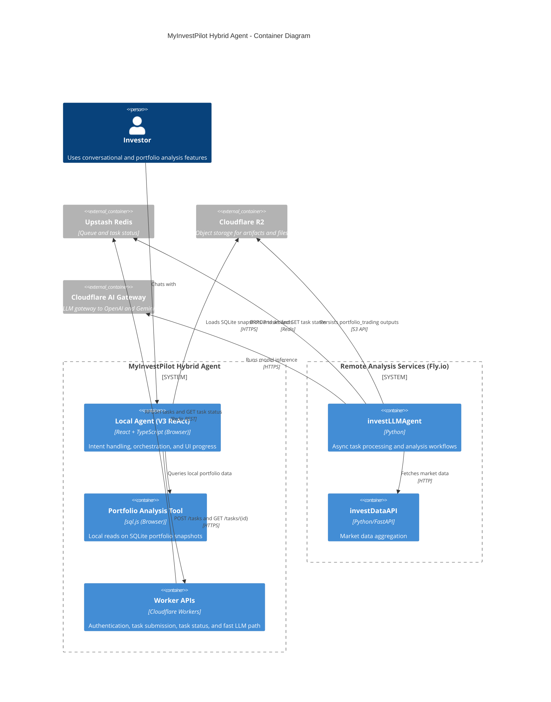

# The Agent Paradox: Why We Built a "Boring" Hybrid Architecture

In the AI hype cycle, everyone is talking about **"Autonomous Agents"**—agents that can plan, reason, and execute anything.

But in financial engineering, **Autonomy is a bug**.
If I ask an agent to "Backtest this strategy," I don't want it to "creatively" invent a new backtesting methodology. I want it to run a **Deterministic Workflow**.
However, if I ask "Why is my portfolio down?", I need it to be **Flexible** enough to understand my specific context.

This is the **Agent Paradox**:
*   **User Intent** is ambiguous and needs flexibility (The Interface).
*   **Financial Logic** is strict and needs 100% reliability (The Core).

To solve this, we didn't build a massive "God Mode" brain. We built a boring, pragmatic **Hybrid Architecture**.

## 1. The Separation of Concerns

We split the agent into two distinct roles, based on **Engineering Constraints**.

| Feature | Local Agent (The Orchestrator) | Remote Agent (The Processor) |
| :--- | :--- | :--- |
| **Identity** | **React Component (`Chat2Invest`)** | **Worker + Python Service** |
| **Role** | **Ambiguity & UI State** | **Determinism & Compute** |
| **Logic** | Flexible ReAct Loop | Fixed Pipelines |
| **Data Scope** | User Interaction, Local DOM | Heavy Market Data |

### The Local Agent (The Private CLI)
The "Local Agent" isn't a magical Chrome extension. It's a standard **React Component** running inside the `Chat2Invest` web app.
Its job is to **Orchestrate**.
*   **Intent Recognition**: It parses "Analyze AAPL" into structured tool calls and task requests.
*   **State Management**: It manages the UI state (loading bars, charts) while the backend crunches numbers.

### The Remote Agent (The Processor)
The Remote Agent is a **bounded async task processor** wrapped in an LLM interface.
*   **Task Protocol**: It receives typed tasks (for example `stock_analysis`) and executes stable worker pipelines.
*   **Reliability Boundary**: Queueing, status transitions, and retries are deterministic; model-generated analysis content is still probabilistic.

## 2. The Architecture: Async by Default

Because the Remote Processor runs heavy workflows (30s+), we can't use synchronous HTTP. We use a standard **Redis Queue** pattern.



### The Payload
We send structured Tasks to `invest_agent_tasks`. Notice the `analysis_context`:
```json
{
  "job_id": "uuid-123",
  "task_type": "stock_analysis",
  "symbols": ["AAPL"],
  "analysis_context": {
    "user_query": "Is it safe to buy AAPL for me?",
    "time_horizon": "medium_term",
    "focus_areas": ["risk_assessment", "valuation", "entry_timing"]
  }
}
```

## 3. The Brain's Memory: Context-Aware Analysis

One of the biggest failures of standard chatbots is **Amnesia**. They treat every query as a blank slate.
*   *User*: "Analyze AAPL."
*   *Bot*: "Here is a generic analysis of Apple."

But in MyInvestPilot, we use **Redis** to give the agent a "Stateful Memory."

### How It Works
1.  **Profile Ingestion**: When you onboard (or update settings), profile fields like risk preference, market preference, and goals are stored in Redis.
2.  **Context Injection**: The local orchestration layer can enrich `analysis_context.user_query` with profile context before task submission.
    > "Analyze AAPL for a conservative investor focused on long-term capital preservation."
3.  **Personalized Output**:
    *   For a *Day Trader*, the agent highlights Volatility and Momentum.
    *   For a *Retiree*, the agent highlights Dividends and Capital Preservation.

This is the power of the Hybrid Architecture: The **Remote Agent** has the compute power to run the analysis, but the **Redis Memory** ensures it stays relevant to *you*.

## 4. War Story: The Evolution (v1 -> v3)

Our architecture didn't start this clean. We learned it the hard way in `myInvestPilotApp`.

### Phase 1: Early Monolithic Attempts (pre-v2)
In early iterations, we tried to let one side handle too many responsibilities: user interaction, tool orchestration, and heavy analysis mixed together.
*   **The Result**: Chaos. The agent would hallucinate database queries. It would try to "fix" the UI by returning raw HTML.
*   **The Lesson**: Mixing UI concerns and heavy analysis logic in one path creates brittle behavior.

### Phase 2: Plan-Execute (v2)
In v2, we introduced explicit planning and step execution on the local side. It improved control, but plans were still rigid and verbose for open-ended conversations.

### Phase 3: The CLI Pattern (v3)
In v3, we treated the Local Agent as a CLI with a **ReAct Loop** in the browser.
*   **The Shift**: The Local Agent became the "Manager." It decides *what* needs to be done and when to delegate.
    *   *User*: "Analyze my portfolio."
    *   *Local Agent*: "Okay, I need to run a deep analysis. I will delegate this to the `RemoteProcessor`."
    *   *Action*: Calls Worker API, which enqueues a Redis task and returns a job ID for polling.

This is the key insight: **The Local Agent handles the Ambiguity. The Remote Agent handles the Work.**

## 5. Why This Matters

This architecture allows MyInvestPilot to handle the "Uncanny Valley" of AI:
*   We use **LLMs (Local)** where we need flexibility (understanding what you want).
*   We use **Code (Remote)** where we need reliability (calculating your money).

It's a "Boring" architecture. And when you're dealing with financial data, **Boring is Good.**

## 6. Join the Discussion

This architecture is just one piece of how I'm approaching AI-native systems. My GitHub ([github.com/madawei2699](https://github.com/madawei2699)) has related explorations in Hybrid Agent design.

If you are a builder grappling with the same "Agent Paradox" (Autonomy vs Reliability), I’d love to hear how you solve it. Do you use a different split? Or do you trust LLMs more than I do?

If you're also experimenting with Local-First AI or Browser-Native Agents, I'd love to hear your take—fork, critique, or just chat on X ([@madawei2699](https://twitter.com/madawei2699)). Open to collaborations or just geeking out over similar ideas—DMs open.
