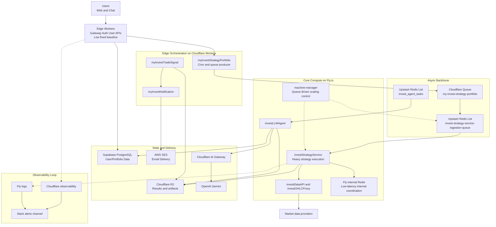

# Running a Multi-Vendor, Event-Driven Cloud Architecture as a Solo Builder

This is the infrastructure chapter of the AI-Native Builder series.

In [Article 1: From Rule-Based Scripts to AI-Native Engines](01_ai_native_primitives_engine.md), I focused on why we need a constrained DSL for reliable decision-making.
In [Article 2: Why I Stopped Writing Code](02_ai_driven_development.md), I explained the "Reverse Waterfall" workflow where AI does the implementation.
In [Article 3: The Agent Paradox](03_hybrid_agent_architecture.md), I detailed the hybrid architecture that splits local flexibility from remote determinism.

This article is about runtime reality: how the system is deployed, scaled, observed, and kept critical costs low enough to maintain healthy unit economics for a solo product.

## 1. Architecture by Subtraction: The Cost-Driven Evolution

MyInvestPilot didn't start with this clean stack. It started with a "Best Practice" mess.
Every component in the current architecture is there because a previous, "standard" solution failed—either on complexity or cost.

### The Compute Retreat: From AWS ECS to Fly.io
In the early days, the open-source version ran on **AWS ECS**.
*   **The Intent**: "Do it like a big tech company."
*   **The Reality**: I spent more time configuring IAM roles, VPC peering, and NAT gateways than writing feature code. The complex permission model paralyzed me.
*   **The Pivot**: I moved to **Cloudflare Workers** for simplicity. It was perfect for the edge, but heavy Python/Pandas logic (the core strategy engine) couldn't run there. I needed a container, but without the Kubernetes tax.
*   **The Solution**: **Fly.io**. At the time of migration, Fly's entry-tier economics made containerized heavy workloads viable for a solo builder. The exact pricing policy changes over time, but the architectural benefit remains the same: pay for workload windows, not idle capacity.

### The Data Strategy: Escaping the "10GB Trap" (Postgres vs. Redis)
My biggest cost blunder was treating Price Data like User Data.
*   **The Problem**: I tried to sync the entire market history (tens of thousands of tickers, millions of rows) into Postgres. The storage volume quickly exceeded **10GB**.
*   **The Bill**: A self-hosted Postgres instance on Fly.io with that volume cost me **~$20/month**. That's $240/year just to store data that nobody reads (99% of tickers are "cold").
*   **The Pivot**: I realized I didn't need a Warehouse; I needed a Cache.
*   **The Solution**:
    *   **Price Data**: Moved to **Redis**. We only fetch and cache price data *on-demand* when a user analyzes a ticker. No more storing the whole market.
    *   **User Data**: With the heavy price data gone, the core relational data (Users, Portfolios) fit easily into a **Supabase free-tier class footprint (~500MB range)**.
*   **The Impact**: I saved $240/year by deleting data.

### The Queue Pivot: From Kafka to Redis
I started with **Upstash Kafka**. It was perfect architecture. Then, Upstash deprecated the free Kafka tier.
I didn't rewrite the app to be synchronous. I switched to **Upstash Redis** (List primitive).
*   *Result*: It is "Poor Man's Kafka," but it costs pennies and handles the throughput effortlessly.

**The Lesson**: Cost didn't just constrain the architecture; it *designed* it.

## 2. Canonical System Scope (Runtime Footprint)

Today, the system serves thousands of trial interactions and a growing paid base, operated by one builder.

The runtime footprint spans:
- `12` Worker apps (`wrangler.toml`) at the edge.
- `7` Fly apps (`fly.toml`) for core Python workloads.
- A mixed storage layer (R2, Redis, Supabase).

### Global Architecture (Cost-Aware View)

The diagram below shows how the "Survivor Stack" fits together.

## 3. How Cost Is Encoded in This Architecture

You can read the P&L statement directly from the topology:

-   **Edge (Cloudflare)**: User-facing APIs invoke Workers ($5/mo fixed).
-   **Async (Redis)**: Bursts are absorbed by Redis Lists (usage-based, negligible).
-   **Compute (Fly.io)**: `machine-manager` scales `investStrategyService` based on queue depth.
-   **Storage (Supabase + R2)**: Relational data stays in the Free Tier; heavy artifacts go to R2 ($0 egress fees).
-   **Data Sync (Redis Cache)**: Price data is on-demand, preventing the "10GB Trap" on Postgres.

Under current load, this architecture keeps yearly infrastructure spend in a **low-thousands RMB range**.
With the current pricing model, this supports healthy gross margins for a solo product.

## 4. The EDA Core: Asynchronous Portfolio Pipeline

The most important production path is event-driven and asynchronous end to end.

1.  `myInvestStrategyPortfolio` (Cron) wakes up and checks schedules.
2.  It emits lightweight messages to Cloudflare Queue.
3.  A consumer enriches them and pushes full tasks to **Upstash Redis Lists**.
4.  `investStrategyService` (Fly.io) consumes tasks and executes the strategy.
5.  Results are written to **Cloudflare R2**.
6.  `myInvestTradeSignal` polls result availability, prepares notification payloads, and enqueues delivery tasks.
7.  `myInvestNotification` sends emails via **AWS SES**.

This design decouples the UI from the heavy lift. Users get "Task Submitted" (fast), while the backend churns (slow but cheap).

## 5. Queue-Driven Scaling: The `machine-manager`

The `investStrategyService` is the most expensive part of the stack.
Historically, my approach to scaling it evolved through three painful stages.

### Phase 1: Single Instance (The Latency Spike)
Initially, I ran a single Fly.io instance.
*   *Theory*: "One strategy takes 10 seconds. One machine is enough."
*   *Reality*: At 9:30 AM (Market Open), hundreds of scheduled portfolios triggered at once. The queue backlog exploded, and users waited 20+ minutes for results.

### Phase 2: Static Scaling (The Cost Wall)
I tried the standard fix: "Just add more servers."
*   *Action*: I manually scaled to 3 instances running 24/7.
*   *Result*: Latency dropped, but my bill jumped to **$50+/month**.
*   *Problem*: I was paying for 3 machines to sit idle 22 hours a day.

### Phase 3: Dynamic Queue Scaling (Scale-to-Zero)
I realized: **No Queue = No Work.** Why pay for idle computers?
I built a custom autoscaler (`machine-manager.py`) that monitors the **Redis Queue Length**.

**The Logic**:
1.  **Scale to Zero**: If `queue == 0` for 5 minutes, shutdown ALL machines. **Cost = $0/hr**.
2.  **Scale Up**: If `queue > 0`, calculate `Target Machines = Queue Length * Coefficient`.
    *   Boot instances immediately via Fly.io API.
    *   They drain the queue in parallel.
3.  **Scale Down**: As the queue empties, machines are terminated one by one.

**The Math (Real World Data)**:
*   **Old Way (Static)**: 3 Shared CPUs (always on) = **~$12/mo**. Slow execution (Shared CPU limit).
*   **New Way (Dynamic)**: Performance-1x CPU (on-demand) = **$6.47/mo**.
    *   I usage "Enterprise-Grade" dedicated CPUs, but only for the ~2 hours they are needed.
    *   **Result**: Faster execution, lower latency, and **50% lower cost**.

## 6. Observability: Practical, Not Platform-Maximal

I don't have a NOC. I use **"Push" Observability** via Slack.

-   `Cloudflare` pushes error logs.
-   `Fly.io` pushes crash alerts.
-   **Application Logic** pushes business events (`Task Completed`, `AI Logic Error`) to `#myinvestpilot-alerts`.

I treat observability as a chat workflow: Alert -> Click Logs -> Fix -> Redeploy.

## 7. Design Principles I Actually Use

1.  **Architecture follows Cost**: If a DB is too expensive (10GB+), the architecture changes (Cache).
2.  **Async-first for heavy work**: Keep interactive APIs thin.
3.  **Scale from queue pressure**: Compute should follow demand, not be provisioned for "what if".
4.  **Use the cheapest reliable primitive**: Redis Lists > Kafka. R2 > S3.
5.  **Multi-Vendor for Fit**: Don't be loyal to AWS. Be loyal to your margins.

## 8. Join the Discussion

If you are a solo builder, how do you handle the "Cloud Tax"? Do you pay for RDS/K8s convenience, or do you "financial engineer" your stack like this?

If you want to see more of the public architecture narrative, check out this repository: [myinvestpilot/ai-architecture](https://github.com/myinvestpilot/ai-architecture).  
For historical context, the early open-source predecessor is [myinvestpilot/invest-alchemy](https://github.com/myinvestpilot/invest-alchemy).

Find me on X ([@madawei2699](https://twitter.com/madawei2699)) or GitHub. Let's build something profitable.
