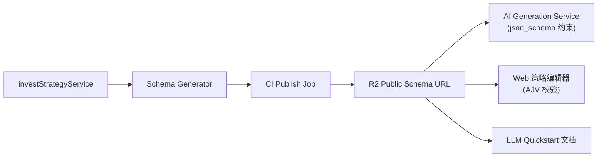
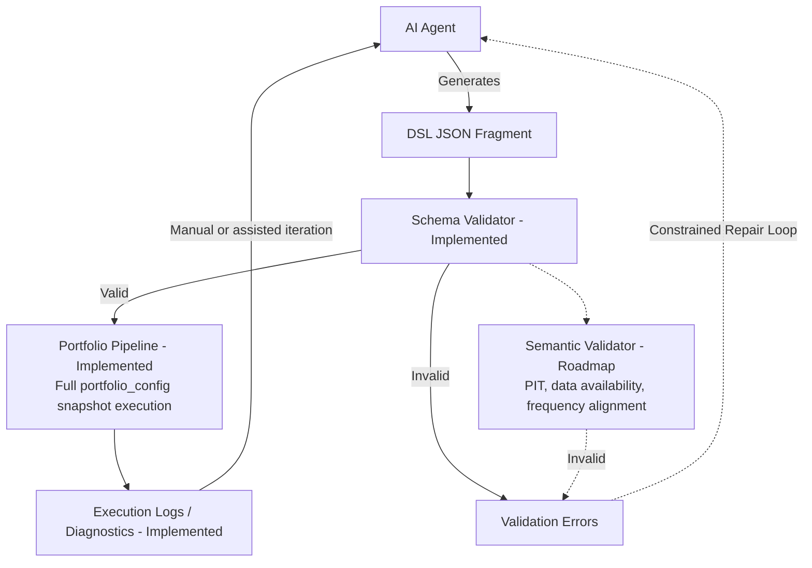

# 从规则脚本到 AI Native 引擎：我为什么做了受约束 DSL

## 1. Builder 的起点：问题不在模型能力，而在系统边界

你好，我是 Dawei ([@madawei2699](https://github.com/madawei2699))。作为一个独立开发者，我发布过 [myGPTReader](https://github.com/myreader-io/myGPTReader) (4.4k stars) 和 [invest-alchemy](https://github.com/myinvestpilot/invest-alchemy) (750+ stars)。

在构建 MyInvestPilot 的过程中，我越来越确定一件事：**在严肃决策系统中，单靠 Prompt Engineering 很难稳定落地。**

我并不是一开始就想做 DSL（领域特定语言），而是先踩了足够多的坑。
起初，我和很多人一样，尝试让 AI 直接生成 Python 策略代码。很快遇到三类问题：
*   **幻觉**：AI 会幻觉出不存在的库 (`import non_existent_pkg`)。
*   **前视偏差**：AI 会写出看起来逻辑完美、但利用了未来数据的代码（Look-ahead bias）。
*   **死循环**：当生成代码出现资源消耗异常时，普通用户几乎无法自行排查。

我意识到：**通用代码接口太宽，很多问题不是“写错了”，而是“边界没定义”。**
对 AI 来说，能做的事情越多，可控性通常越差。

要构建一个真正的 AI Native 系统，我们需要把 **"意图" (Intent)** 和 **"执行" (Execution)** 彻底分离开来。

## 2. 核心决策：为什么不直接修代码路径？

为了让 AI 输出可靠的决策逻辑，我推演了三条技术路径：

### 路径 A：Code Generation + Sandbox（最直觉的选择）
这是绝大多数 Agent 框架（如 AutoGPT）的做法：让 AI 写 Python，然后在 Docker 容器里跑。
*   **优点**：无限的灵活性。
*   **缺点**：**安全性与不可控**。即便有沙箱能隔离资源，逻辑层的 bug（比如资金管理错误）依然无法由用户修复。更致命的是，非技术用户看到一堆 Python 代码时，他是恐慌的，而不是掌控的。

### 路径 B：Super API（SaaS 标配）
这是传统 SaaS 的做法：搞一个巨大的 API，让 AI 去填参数。
*   **优点**：绝对安全，类型强校验。
*   **缺点**：**参数爆炸**。当你试图让 AI 表达 `(RSI > 30 AND (MA50 > MA200 OR Volume > 1M))` 这种嵌套逻辑时，API 的 JSON 结构会变得像迷宫一样复杂，AI 的 Token 消耗巨大且极其容易出错。

### 路径 C：DSL（中间路线）
我意识到，我需要的是 **API 的安全性** 加上 **代码的表达力**。
这就是 **DSL (Domain Specific Language)** 的意义。

*   **约束 (Constraint)**：AI 只能使用我提供的乐高积木（Primitives）。它不能 import `os`，也不能删库跑路。
*   **正交 (Orthogonality)**：这些积木可以自由组合。你可以把“趋势策略”和“财务风控”像搭积木一样拼在一起。
*   **可视化 (Visual)**：因为本质是结构化的 JSON，我们可以轻松构建[可视化编辑器](https://www.myinvestpilot.com/primitives-editor)，让用户一眼看懂 AI 到底生成了什么，而不是去读代码。

## 3. Schema Supply Chain：让约束与实现保持同源

在 MyInvestPilot 中，Schema 是事实源。我们不手工维护 prompt，而是由同一份契约生成。



这就是我们的 **"Schema 供应链"**：
1.  **文档即代码**：[Quickstart Guide](https://www.myinvestpilot.com/docs/primitives/_llm/llm-quickstart.txt) 是直接从代码定义的 Schema 生成的。这意味着 AI 读的说明书，和引擎跑的代码，永远是 100% 同步的。没有“漂移”。
2.  **分层防御 (Layered Validation)**：
    *   **Layer A (Compiler)**：前端用 AJV 确保存储的 JSON 符合结构定义。
    *   **Layer B (Runtime)**：后端引擎进行严格的类型检查。
    *   **Layer C (Today + Target)**：当前已落地的是定向一致性 guard（例如基本面输入一致性、市场依赖检查）；独立语义验证层是下一步。

这套机制的目标很明确：把 LLM 的角色收敛成“受约束的翻译器”，而不是“自由发挥的作者”。
完整原语定义的公开 Schema 在这里：[https://media.i365.tech/myinvestpilot/primitives_schema.json](https://media.i365.tech/myinvestpilot/primitives_schema.json)。它是原语策略 IR 校验、Prompt 生成与可视化编辑器渲染的同一事实源。

一句话概括这套边界：**LLM 更像 parser/translator，负责生成受约束的策略 IR；组合引擎负责在完整配置快照上做确定性执行。**

### 运行时验证 (Runtime Validation)



当前仍是 Schema-First 阶段：结构校验已落地；语义层主要通过定向 guard 和执行日志反馈来收敛。换句话说，语义验证已部分存在于执行路径中，但还不是独立的统一 runtime stage。

## 4. 方案落地：一个基本面与技术面组合案例

我不把投资看作是写脚本，通过 DSL 我把它抽象为 **"正交真理的配置"**。

看一个真实例子：**基本面风控策略**。
我们希望 AI 表达的是：“只有在处于上涨趋势（技术面），且公司 ROE > 10% 且负债率 < 80%（基本面）时才买入，并根据负债率动态调整仓位。”

AI 生成的 DSL (JSON) 如下：

```json
{
  "fundamental_inputs": {
    "metrics": ["roe", "pe_ttm", "revenue_yoy", "operating_cashflow", "debt_ratio"],
    "frequency": "daily",
    "point_in_time": true, 
    "max_staleness_days": 120
  },
  "trade_strategy": {
    "indicators": [
      { "id": "ema_fast", "type": "EMA", "params": { "period": 50, "column": "Close" } },
      { "id": "ema_slow", "type": "EMA", "params": { "period": 200, "column": "Close" } },
      { "id": "roe_metric", "type": "ROE" },
      { "id": "debt_metric", "type": "DebtRatio" },
      { "id": "cashflow_metric", "type": "OperatingCashflow" },
      { "id": "roe_min", "type": "Constant", "params": { "value": 10.0 } },
      { "id": "debt_max", "type": "Constant", "params": { "value": 80.0 } },
      { "id": "cashflow_min", "type": "Constant", "params": { "value": 0.0 } }
    ],
    "signals": [
      // 1. 技术面趋势
      { "id": "trend_up", "type": "GreaterThan", "inputs": [{ "ref": "ema_fast" }, { "ref": "ema_slow" }] },
      // 2. 基本面过滤
      { "id": "roe_ok", "type": "GreaterThan", "inputs": [{ "ref": "roe_metric" }, { "ref": "roe_min" }] },
      { "id": "debt_ok", "type": "LessThan", "inputs": [{ "ref": "debt_metric" }, { "ref": "debt_max" }] },
      { "id": "cashflow_ok", "type": "GreaterThan", "inputs": [{ "ref": "cashflow_metric" }, { "ref": "cashflow_min" }] },
      // 3. 逻辑组合 (AND)
      {
        "id": "risk_gate",
        "type": "And",
        "inputs": [ { "ref": "trend_up" }, { "ref": "roe_ok" }, { "ref": "debt_ok" }, { "ref": "cashflow_ok" } ]
      },
      // 4. 动态仓位 (Linear Weighting)
      {
        "id": "debt_scaled_weight",
        "type": "LinearScaleWeight",
        "inputs": [{ "ref": "debt_metric" }],
        "params": {
          "min_indicator": 20.0,
          "max_indicator": 80.0,
          "min_weight": 1.0,
          "max_weight": 0.45,
          "clip": true
        }
      },
      // 5. 最终决策信号
      {
        "id": "target_weight_signal",
        "type": "Multiply",
        "inputs": [{ "ref": "debt_scaled_weight" }, { "ref": "risk_gate" }]
      }
    ],
    "outputs": {
      "buy_signal": "risk_gate",
      "target_weight": "target_weight_signal"
    }
  }
}
```

这种配置是 **Stateless (无状态)** 和 **Declarative (声明式)** 的。
引擎不需要知道“业务意图是怎么写出来的”，它只需要在既定原语上执行。这样的分离，让我们可以在底层持续优化性能，而不破坏上层策略表达。
在执行层，我们优先保证基于完整 `portfolio_config` 快照的确定性重放（包含标的池、市场、币种、手续费、时间范围与资金策略等上下文），以确保可复现与可审计。

## 5. 现实的妥协：DSL 不是银弹

技术没有宗教，只有权衡。
尽管 DSL 解决了 90% 的问题，但它不适合处理极其复杂的、带有内部状态的逻辑（比如复杂的板块轮动状态机）。

所以我们的引擎支持 **双轨制 (Two Strategy Paths)**：
1.  **Primitive DSL path**：适合易组合、无状态的逻辑（90% 的 AI生成场景）。
2.  **Code strategy path**：允许高阶人类玩家手写 Python 代码处理复杂状态。

保留代码路径，是为了避免掉进 **"DSL Hell"**：为了覆盖少量边缘需求，把 DSL 本身做成另一门复杂编程语言。

## 6. 为什么这件事重要？

这套架构的价值在于：它把 AI 的角色稳定在 **Strategy Architect（策略表达层）**，而不是执行层。

1.  **User Prompt**: "帮我写个稳健的策略。"
2.  **System Prompt**: 注入自动生成的 Schema 文档。
3.  **AI Output**: 生成合法的 JSON。
4.  **Verification**: 这里的 [可视化编辑器](https://www.myinvestpilot.com/primitives-editor) 瞬间渲染，人类确认。

**Input -> JSON -> Visual Verification -> Execution。**
这个闭环的意义是可验证、可复现，而不仅仅是“能生成代码”。

### 核心设计原则

1.  **在源头约束生成空间**，而不是在下游去修 Bug。
2.  **先验证，再执行** (Schema First)。
3.  **分离意图 (Intent)** 与 **执行 (Execution)**。
4.  **复现性 (Reproducibility)** 优于局部效率。

## 7. 加入讨论

这只是我构建 AI Native 系统探索的第一部分。我的 GitHub ([github.com/madawei2699](https://github.com/madawei2699)) 上还有更多关于 Hybrid Agent 和工作流的探索。

如果你也在做类似的受约束 AI 决策系统，欢迎来 X ([@madawei2699](https://twitter.com/madawei2699)) 交流。
