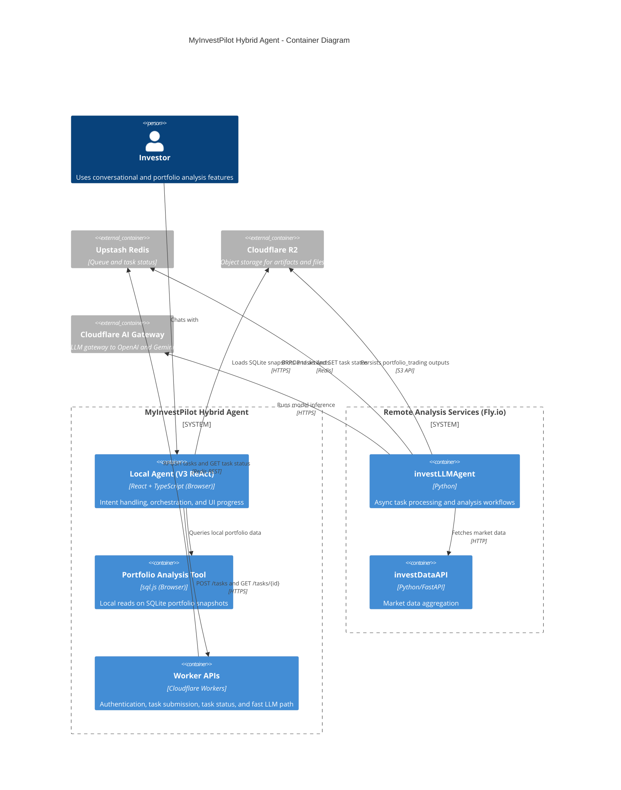

# Agent 悖论：为什么我们做的是“无聊但可靠”的混合架构

在 AI 热潮里，很多人讨论的是 Autonomous Agent：能规划、能执行、能自我迭代的一体化智能体。

但在金融工程场景里，**过度自主往往是风险源**。
当我说“回测这个策略”时，我需要的是确定性执行；当我问“为什么我的组合最近回撤变大”时，我又需要它能理解用户语境。这个矛盾就是我在 Chat2Invest 里长期面对的 Agent 悖论。

## 1. 关注点分离（The Separation of Concerns）

我没有做一个“全能大脑”，而是按工程约束把 Agent 拆成两层：

| 特性 | Local Agent（Orchestrator） | Remote Agent（Processor） |
| :--- | :--- | :--- |
| **身份** | 浏览器内 React 组件（`Chat2Invest`） | Worker + Python 服务 |
| **角色** | 处理模糊意图、维护 UI 状态 | 处理确定性流水线与重计算 |
| **逻辑风格** | 灵活 ReAct Loop | 固定任务管道 |
| **数据范围** | 用户交互、前端上下文 | 市场数据、计算任务、异步状态 |

### The Local Agent（浏览器里的“私有 CLI”）

Local Agent 不是浏览器插件，而是 Web 应用内的 React 组件。它负责：

- 意图识别：把自然语言转成结构化任务请求。
- 状态编排：在远端计算期间维护进度、图表、消息状态。
- 上下文注入：把用户画像和会话上下文整理进请求载荷。

### The Remote Agent（任务处理器）

Remote Agent 是边界清晰的异步任务处理器：

- 接收类型化任务（如 `stock_analysis`）。
- 执行稳定的后台 pipeline（队列、状态流转、重试）。
- 输出分析结果并更新任务状态。

这里需要强调：队列与状态机是确定性的，模型生成的分析文本仍然是概率性的。这两层边界不能混淆。

## 2. 架构：默认异步（Async by Default）

远端分析流程经常超过 30 秒，不能走同步 HTTP 阻塞请求。
因此我们采用 Redis 队列作为异步主干，前端提交任务并轮询状态。



### The Payload

我们提交到 `invest_agent_tasks` 的任务是结构化 JSON，核心是 `analysis_context`：

```json
{
  "job_id": "uuid-123",
  "task_type": "stock_analysis",
  "symbols": ["AAPL"],
  "analysis_context": {
    "user_query": "Is it safe to buy AAPL for me?",
    "time_horizon": "medium_term",
    "focus_areas": ["risk_assessment", "valuation", "entry_timing"]
  }
}
```

## 3. 大脑的“记忆”：Context-Aware Analysis

很多聊天系统的问题不是“不会回答”，而是“每轮都当作第一次见面”。

在 MyInvestPilot 里，我们通过 Redis 和本地编排层，把用户历史偏好、目标和当下问题放在同一个任务上下文里。

### How It Works

1. **Profile Ingestion**：用户入驻或更新偏好时，把风险偏好、市场偏好、目标等字段写入 Redis。
2. **Context Injection**：Local Agent 在提交任务前，把画像信息注入 `analysis_context.user_query`。
   > "Analyze AAPL for a conservative investor focused on long-term capital preservation."
3. **Personalized Output**：同一只股票会因用户画像不同给出不同重点。
   - Day Trader：更强调波动率与动量。
   - Retiree：更强调分红与本金保护。

这就是混合架构的关键价值：Remote 负责算力，Local 负责把算力结果放回“这个用户”的语境里。

## 4. 复盘：从 v1 到 v3（War Story）

这套结构不是一开始就对，而是踩坑迭代出来的。

### Phase 1: Early Monolithic Attempts (pre-v2)

早期我们把交互、工具编排、重分析混在一条路径上。

- 结果：系统不稳定，职责边界模糊。
- 常见症状：Agent 幻觉数据库查询，甚至试图返回原始 HTML“修 UI”。
- 教训：UI 关注点和重计算关注点混在一起，会放大脆弱性。

### Phase 2: Plan-Execute (v2)

v2 引入了显式 planning + step execution，本地控制力明显提升。
但对开放式对话来说，这种计划有时过于刚性，交互体验不够自然。

### Phase 3: The CLI Pattern (v3)

v3 把 Local Agent 视为浏览器里的 CLI + ReAct Loop：

- 用户提出目标。
- Local Agent 判断是本地工具即可完成，还是需要委托远端。
- 若需远端：调用 Worker API 入队并拿到 job id。
- Remote Processor 异步执行并更新状态。
- Local Agent 轮询状态并持续更新 UI。

核心分工最终稳定为一句话：**Local 处理模糊性（Ambiguity），Remote 处理工作量（Workload）。**

## 5. 为什么这件事重要（Why This Matters）

这套架构的意义不是“更炫的 Agent”，而是把 AI 的灵活性放在正确边界内：

- 在理解用户意图时，用 LLM 的灵活性。
- 在资金相关计算时，用代码和流水线的确定性。

对金融系统而言，“无聊”通常比“聪明”更可靠。

## 6. 加入讨论（Join the Discussion）

这只是我在 AI Native 系统里的一部分实践。如果你也在处理类似的 Agent 边界问题（Autonomy vs Reliability），欢迎交流你的拆分方式。

相关公开内容在这里：
- [myinvestpilot/ai-architecture](https://github.com/myinvestpilot/ai-architecture)
- X: [@madawei2699](https://twitter.com/madawei2699)
