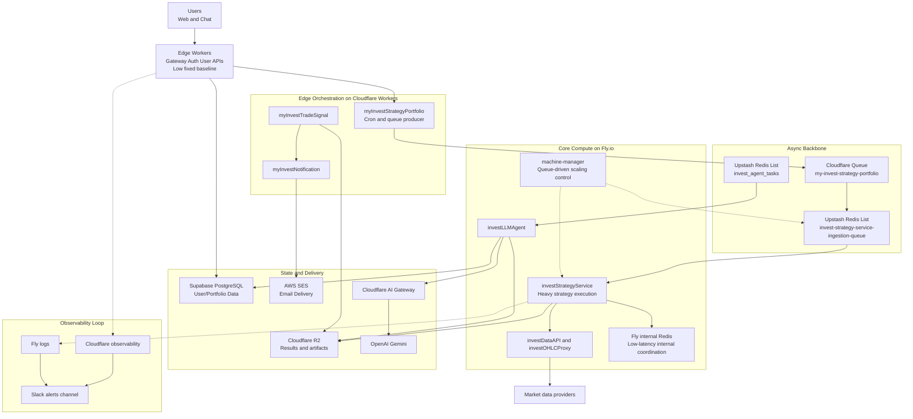

# 一人公司的云架构：多供应商、事件驱动与低成本运行

这是 AI Native Builder 系列的基础设施篇。

- [第一篇](01_ai_native_primitives_engine.md) 讲了为什么我们需要 DSL 来约束 AI。
- [第二篇](02_ai_driven_development.md) 讲了“倒置瀑布流”的开发方法。
- [第三篇](03_hybrid_agent_architecture.md) 讲了解决 Agent 悖论的混合架构。

这一篇聚焦运行时现实：如何部署、如何扩缩、如何观测，以及如何把成本维持在可持续区间。

## 1. 减法架构：由成本倒逼的演进史 (Architecture by Subtraction)

MyInvestPilot 现在的架构并不是一开始就设计好的，而是多次在复杂度和成本之间取舍后收敛出来的。
现在保留下来的每个组件，都对应一个真实的工程问题。

### 计算层的撤退：从 AWS ECS 到 Fly.io
起初，为了追求所谓的“大厂最佳实践”，我把开源版本部署在 **AWS ECS** 上。
*   **初衷**：“像大公司一样正规。”
*   **现实**：我花了大量时间在 IAM、VPC、NAT Gateway 等基础配置上，而不是产品迭代本身。对单人开发来说，这个复杂度成本过高。
*   **转折**：我先迁到 **Cloudflare Workers** 承接边缘能力。它在交互链路上很合适，但核心策略服务依赖 Python/Pandas，仍需要容器运行环境。
*   **解法**：**Fly.io**。
    *   它允许我把 Docker 容器跑在 MicroVM 上。
    *   更重要的是它的计费哲学：**为工作窗口付费，而不是为闲置容量付费**。
    *   在迁移阶段，Fly 的入门级成本结构对单人项目非常友好。即使后续价格策略变化，这个阶段的关键收益依然成立：重计算可以按工作窗口付费。

### 数据策略：逃离 "10GB 陷阱" (Postgres vs. Redis)
我犯过最大的成本错误，是把“行情数据”当成“核心用户数据”来存。
*   **问题**：我试图把全市场的历史行情（数万个 Ticker，数百万行 K 线）同步到 Postgres 中。数据量迅速膨胀超过 **10GB**。
*   **账单**：在 Fly.io 上，维护一个 10GB+ 的高可用 Postgres 实例，每月成本约为 **$20**。一年就是 **$240**。而这其中 99% 的数据是“冷”的（没人看的 Ticker）。
*   **顿悟**：行情数据不是资产，是耗材。我不需要一个 Data Warehouse，我只需要一个 Cache。
*   **解法**：
    *   **行情数据 -> Redis**：当用户查询某个 Ticker 时，按需去上游拉取并缓存。用完即焚（设置 TTL）。
    *   **用户数据 -> Supabase**：把重数据挪走后，剩下的用户、组合、配置数据非常轻量，轻松塞进 **Supabase 的 Free Tier (500MB)**。
*   **影响**：通过删数据，我每年省下了 $240。

### 队列的平替：从 Kafka 到 Redis List
起初我使用 **Upstash Kafka**，架构图画出来很漂亮。直到 Upstash 取消了 Kafka 的免费额度。
我没有去重写代码搞同步调用（那会阻塞我的 Worker），我只是把 Kafka Client 换成了 **Upstash Redis (List Primitive)**。
*   **结果**：用 Redis 的 `LPUSH` 和 `BRPOP` 实现了一个“穷人的 Kafka”。成本几乎忽略不计，但吞吐量完全满足需求。

**教训**：如果架构长期超出预算，通常不是“云太贵”，而是分层和边界设计还不够好。

## 2. 标准系统范围 (Runtime Footprint)

目前，这个由单人维护的系统支撑着几千次试用交互和持续增长的付费用户。
它的运行时足迹 (Footprint) 包括：
- `12` 个 Edge Worker 应用（`wrangler.toml`）。
- `7` 个 Core Fly 应用（`fly.toml`）。
- 一个混合存储层（R2, Redis, Supabase）。

### 全局架构图 (Cost-Aware View)

这张图不仅是架构图，也是一张成本地图：

## 3. 成本是如何编码进架构的

我们可以直接从拓扑结构中读出 P&L（损益表）：

-   **Edge (Cloudflare)**: 用户侧 API 主要落在 Workers，基础成本可控。
-   **Async (Redis)**: 突发流量由 Redis List 吸收，按使用计费。
-   **Compute (Fly.io)**: `machine-manager` 根据队列深度动态开关机器。
-   **Storage (Supabase + R2)**: 结构化数据留在 Free Tier；大文件（回测报告、JSON Artifacts）扔进 R2（**零出口流量费**，这是 AWS S3 做不到的）。
-   **Data Sync (Redis Cache)**: 行情数据按需加载，避免了 10GB 的数据库账单。

在当前负载下，这套架构将年化基础设施成本控制在低千元人民币区间，并维持健康毛利空间。

## 4. EDA 核心与异步管道

整个系统最重要的生产链路（投资组合分析）是全异步、事件驱动的。

1.  `myInvestStrategyPortfolio` (Cron Worker) 唤醒并检查调度表。
2.  发送轻量级消息到 Cloudflare Queue。
3.  消费者 Worker 补全任务上下文，写入 **Upstash Redis List**。
4.  `investStrategyService` (Fly.io) 从 Redis 拉取任务，执行策略计算。
5.  结果写入 **Cloudflare R2**。
6.  `myInvestTradeSignal` 检查结果并组织通知任务。
7.  `myInvestNotification` 通过 **AWS SES** 发送邮件通知。

这个设计把“即时反馈”和“繁重计算”彻底解耦。用户点击提交后立刻得到反馈，而后端可以从容地（便宜地）处理计算任务。

## 5. 队列驱动扩缩容：Machine Manager

`investStrategyService` 是整个栈里最贵的组件（Python, Pandas, 内存密集型）。
关于它的扩缩容，我经历了三个痛苦阶段：

### Phase 1: 单实例（延迟峰值）
最初我只跑一个 Fly.io 实例。
*   *理论*：“跑一个策略只要 10 秒，一台机器够了。”
*   *现实*：早上 9:30 开盘，几百个用户的定时任务通过 Cron 同时触发。队列瞬间积压，排在后面的用户要等 **20 分钟** 才能收到推送。体验极差。

### Phase 2: 静态扩容（成本墙）
我尝试了标准解法：“加机器”。
*   *动作*：手动扩展到 3 台机器，24 小时运行。
*   *结果*：延迟解决了，但账单变成了 **$50+/月**。
*   *问题*：大量时段处于空闲付费状态，成本效率很差。

### Phase 3: 动态队列缩放 (Scale-to-Zero)
我意识到：**No Queue = No Work**。不应该为空闲容量长期付费。
我写了一个自定义的 Autoscaler (`machine-manager.py`)，监控 Redis 队列长度。

**逻辑**：
1.  **Scale to Zero**: 如果 `queue == 0` 持续 5 分钟，立刻关机。**成本 = $0/hr**。
2.  **Scale Up**: 只要 `queue > 0`，计算 `Target Machines = Queue Length * Coefficient`。
    *   直接调用 Fly.io API 启动机器。
    *   多台机器并行消费队列。
3.  **Scale Down**: 队列清空后，逐步回收。

**真实数学对比**：
*   **Old Way (Static)**: 3 个共享 CPU 实例 (Shared CPU) 常开 = **~$12/mo**。性能一般。
*   **New Way (Dynamic)**: 使用性能更强的 **Performance-1x CPU** (专用核心)。
    *   单价虽然高，但我每天只需要开 2 小时。
    *   **最终账单**: 约 **$6.47/mo**。
    *   **结果**: 这里有一个反直觉的结论 —— **使用更贵的机器（专用核）反而更省钱**，因为它处理得快，关机得快。延迟降低了，成本也降低了 50%。

## 6. 可观测性：务实而非堆砌

我没有先上复杂的 NOC 仪表盘，而是采用 **Push Observability** 的务实方案。

*   **Cloudflare** 报错？推 Slack。
*   **Fly 机器** 崩溃？推 Slack。
*   **业务逻辑** 异常（如“策略生成了空信号”）？推 Slack 到 `#myinvestpilot-alerts` 频道。

对单人团队来说，关键是响应闭环足够短：
报警 -> 定位日志 -> 修复 -> 验证。

## 7. 我真正使用的设计原则

1.  **Architecture follows Cost (架构追随成本)**：如果数据库太贵，那就换种存法。不要为了“标准范式”付费。
2.  **Async-first for heavy work (重任务异步优先)**：保持交互式 API 的轻量。
3.  **Scale from queue pressure (基于队列压力扩缩)**：计算资源应该跟随需求曲线，而不是被静态预配。
4.  **Cheapest reliable primitive (最廉价的可靠原语)**：Redis List 优于 Kafka，R2 优于 S3。
5.  **Multi-Vendor for Fit (多供应商)**：供应商选择服务于稳定性和成本目标，而不是平台偏好。

## 8. 加入讨论

如果你也是独立开发者，面对“云税”（Cloud Tax）时是怎么做取舍的？欢迎交流你的实践。

如果你想看更多代码细节，可以访问这个仓库：[myinvestpilot/ai-architecture](https://github.com/myinvestpilot/ai-architecture)。
早期的开源前身在这里：[myinvestpilot/invest-alchemy](https://github.com/myinvestpilot/invest-alchemy)。

欢迎在 X 上找到我 ([@madawei2699](https://twitter.com/madawei2699))，或在 GitHub 交流。
